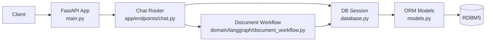
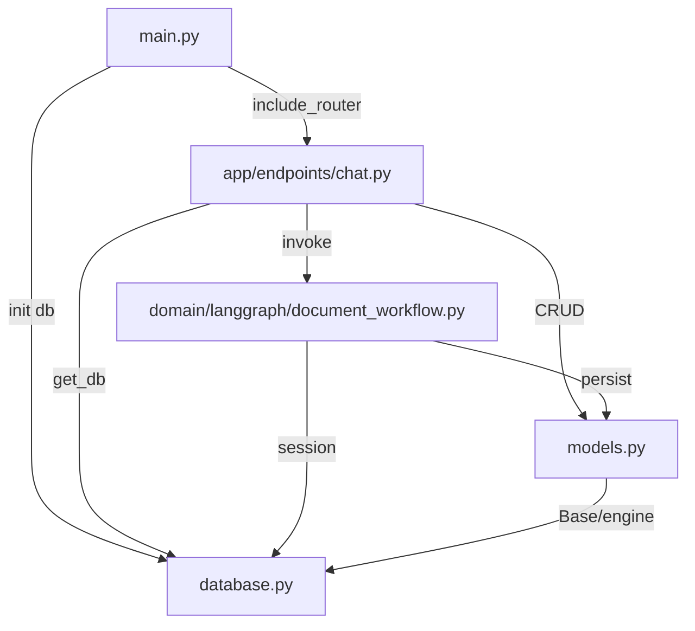
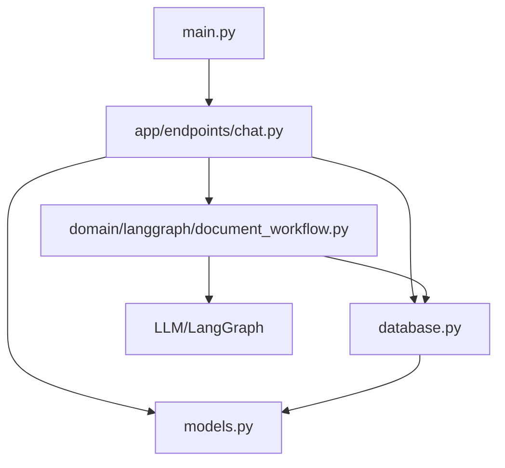

# CICDAutoDoc-FastAPI 문서

## 프로젝트 개요
# 프로젝트 개요
## 1. 목적
- LangGraph 기반 문서 생성 워크플로우를 FastAPI로 노출하고, 채팅형 인터랙션을 통해 문서 생성/조회 기능을 제공하는 경량 백엔드
- SQLAlchemy를 통한 영속 저장소 연동으로 생성 상태/결과를 관리하며, CI/CD 파이프라인과 연동 가능한 자동 문서화 백엔드 기반 제공

## 2. 주요 기능
- 채팅 관련 REST API 제공(app/endpoints/chat.py): 프롬프트 입력, 진행 상태 조회, 결과 전달
- LangGraph 문서 생성 워크플로우(domain/langgraph/document_workflow.py) 오케스트레이션
- 데이터베이스 연결 및 세션 관리(database.py)로 트랜잭션/리소스 수명 주기 제어
- ORM 모델(models.py) 정의로 생성 결과/이력 등 도메인 엔티티 영속화
- FastAPI 애플리케이션 초기화 및 라우터 등록(main.py)
- 소규모 코드베이스(함수≈30, 클래스≈10) 기반의 확장/유지보수 용이성

## 3. 기술 스택
- Frontend
  - 별도 프런트엔드 미포함(REST API 소비자: 외부 클라이언트/툴)
- Backend
  - Python, FastAPI, LangGraph
  - SQLAlchemy ORM
  - Uvicorn(실행 서버, 일반적 구성)
- Database
  - SQLAlchemy 호환 RDBMS(예: PostgreSQL/SQLite)
  - 세션/트랜잭션 관리(database.py), ORM 모델(models.py)

## 4. 아키텍처 개요
- 디렉터리/파일 역할
  - main.py: 애플리케이션 엔트리, 라우터 마운트
  - app/endpoints/chat.py: 채팅 도메인 REST 엔드포인트
  - domain/langgraph/document_workflow.py: 문서 생성 도메인 로직(LangGraph 기반)
  - database.py: DB 엔진 초기화, 세션 팩토리/의존성
  - models.py: SQLAlchemy ORM 엔티티 정의
- 계층 흐름
  - API 계층(app/endpoints) → 도메인 계층(domain/langgraph) → 인프라 계층(database, models)
  - 비즈니스 로직은 엔드포인트에서 분리되어 LangGraph 워크플로우로 캡슐화
  - 세션 주입으로 데이터 접근을 일관되게 관리

## 5. 강점/특징
- 분리된 계층 구조: 엔드포인트·도메인 워크플로우·인프라 분리로 테스트/유지보수 용이
- 워크플로우 기반 생성: LangGraph로 문서 생성 과정을 명시적으로 모델링해 재현성과 확장성 확보
- 경량 FastAPI 백엔드: 비동기 친화적이며 라우팅/검증(일반적으로 Pydantic) 체계화 용이
- 표준 ORM 채택: SQLAlchemy로 DB 독립성 및 마이그레이션/스키마 관리 용이
- 확장 용이성: 라우터 추가, 워크플로우 노드 확장, 모델 확장으로 기능 단위 진화 가능
- 규모 적정성: 함수/클래스 수 기준 소형~중형 난이도 수준으로 온보딩 및 코드 파악 용이

## 아키텍처 분석
# 시스템 아키텍처
## 1. 계층 구조
- API 레이어
  - app/endpoints/chat.py: 채팅 관련 REST API 엔드포인트(FastAPI 라우터)
  - main.py: FastAPI 애플리케이션 초기화 및 라우터 등록
- 도메인/서비스 레이어
  - domain/langgraph/document_workflow.py: LangGraph 기반 문서 생성/처리 워크플로우 오케스트레이션
- 데이터 액세스/ORM 레이어
  - models.py: SQLAlchemy ORM 엔티티 정의
  - database.py: 데이터베이스 엔진/세션/연결 수명 관리
- 인프라/환경
  - database.py: 연결 설정(드라이버/DSN/풀링)과 세션 팩토리 제공

의존성 방향(일반적 패턴): API → 도메인/서비스 → ORM/DB

## 2. 주요 컴포넌트
- main.py (fn=3, cl=0)
  - 역할: FastAPI 앱 생성, 미들웨어/예외 처리기 설정, 엔드포인트 라우터 포함
  - 상호작용: app/endpoints/chat.py 라우터 포함; 애플리케이션 시작 시 database.py 초기화 훅 사용 가능
- app/endpoints/chat.py (fn=8, cl=2)
  - 역할: 채팅 메시지 송수신, 대화 이력 조회, 문서 생성 트리거 등 REST 엔드포인트 제공
  - 복잡도: 함수 8/클래스 2로, 요청 검증 스키마/응답 모델, 의존성 주입(get_db) 및 서비스 호출을 포함하는 수준
  - 상호작용: domain/langgraph/document_workflow.py 호출로 워크플로우 실행; models.py를 통해 메시지/세션 영속화; database.py의 세션 의존성 사용
- domain/langgraph/document_workflow.py (fn=12, cl=3)
  - 역할: LangGraph 노드 정의와 그래프 실행, 문서 생성/요약/후처리 파이프라인 관리
  - 복잡도: 함수 12/클래스 3으로 오케스트레이션, 상태 관리, 에러/재시도 정책 등 코어 로직 집중
  - 상호작용: DB 세션을 받아 models.py 엔티티 생성/갱신; 외부 LLM/툴 호출 후 결과 저장
- models.py (fn=2, cl=4)
  - 역할: 채팅 메시지, 세션, 문서, 작업(job) 등 핵심 도메인 엔티티 정의 및 관계 매핑
  - 상호작용: database.py에서 제공하는 Base/엔진과 연동; API/워크플로우에서 CRUD에 사용
- database.py (fn=5, cl=1)
  - 역할: SQLAlchemy 엔진 생성, 세션 팩토리(SessionLocal) 및 FastAPI 의존성(get_db) 제공, 연결/트랜잭션 수명 관리
  - 상호작용: models.py가 Base를 참조하거나, 앱 시작 시 테이블 생성(create_all) 수행

## 3. 데이터/제어 흐름
- 애플리케이션 부팅
  - main.py가 FastAPI 인스턴스를 생성하고 app/endpoints/chat.py 라우터를 등록
  - database.py에서 엔진/세션 팩토리 초기화(환경 변수 기반 DSN, 풀 크기 설정 등)
- 요청 처리(예: 문서 생성이 포함된 채팅 요청)
  - 클라이언트 → FastAPI 엔드포인트(app/endpoints/chat.py)
  - 의존성 주입으로 database.py의 세션(get_db) 획득
  - 입력 검증 후 domain/langgraph/document_workflow.py 호출
- 워크플로우 실행
  - LangGraph 노드 실행(프롬프트/도구 호출/후처리)
  - 중간/최종 산출물(models.py 엔티티) 생성 또는 갱신
  - 세션 범위 내 트랜잭션 커밋/롤백 처리
- 응답 반환
  - 저장된 결과를 조회하여 직렬화
  - chat.py에서 HTTP 응답으로 반환
- 이력/조회 흐름
  - chat.py가 models.py를 통해 대화/문서 기록 조회
  - 필요 시 페이징/필터링 적용 후 응답

## 4. Mermaid 다이어그램

## 5. 설계 고려사항
- 트랜잭션 관리
  - 적용: FastAPI 의존성(get_db)에서 세션 yield 후 커밋/롤백/종료 일관 처리
  - 도입: 워크플로우 단위의 세션 경계 설정 및 원자성 보장을 위한 세분화된 트랜잭션
- 비동기 I/O
  - 확인: chat.py의 비동기 엔드포인트와 SQLAlchemy 동기 엔진 혼용 여부
  - 도입: AsyncEngine/AsyncSession 또는 전용 스레드 풀 사용으로 블로킹 최소화
- LangGraph 실행 안정성
  - 추가: 노드별 타임아웃/재시도/서킷브레이커
  - 강화: 실행 상태/로그/메트릭 수집으로 실패 분석 및 재실행 지원
- 성능 및 확장성
  - 적용: 세션 풀 크기/시간 제한 튜닝, N+1 쿼리 방지를 위한 selectinload/joinedload
  - 도입: 결과 캐싱(예: 문서 생성 결과 해시 기반), 백그라운드 작업 큐로 장기 작업 오프로딩
- 스키마 및 마이그레이션
  - 도입: Alembic 마이그레이션 파이프라인
  - 강화: 모델 변경 시 마이그레이션 자동 생성/리뷰 프로세스
- 입력/출력 계약
  - 분리: Pydantic 스키마 모듈로 요청/응답 모델 정의 및 버전 관리
  - 추가: 대용량 페이로드 스트리밍/청크 업로드 처리(문서 기반 워크플로우 대비)
- 오류 처리와 관찰성
  - 적용: 표준화된 예외 매핑(HTTPException), 구조화 로깅
  - 도입: 트레이싱(OpenTelemetry)과 APM 통합, 주요 경로에 메트릭 추가
- 보안
  - 추가: 인증/인가 미들웨어(OAuth2/JWT), 입력 유효성 강화
  - 제한: 모델/워크플로우 호출에 대한 레이트 리밋과 감사 로그

## 핵심 모듈
# 핵심 모듈

### 메인 애플리케이션(main.py)
- 목적: FastAPI 애플리케이션 초기화와 라우터 등록, 서버 진입점 제공
- 핵심 기능:
  - FastAPI 앱 생성 및 전역 미들웨어/설정 적용
  - 채팅 API 라우터 포함 및 경로 프리픽스 구성
  - 헬스체크/루트 엔드포인트 노출 및 OpenAPI 스키마 제공
- 의존성: FastAPI/Starlette, app.endpoints.chat(APIRouter), Uvicorn(실행)
- 기술 특성: 애플리케이션 팩토리 패턴, ASGI 구성, 라우터 모듈화, OpenAPI 자동 문서화
- 개선 포인트:
  - 분리 환경설정(Pydantic BaseSettings)과 프로파일별 설정 주입
  - 도입 애플리케이션 수명주기(lifespan)에서 DB 연결/자원 관리
  - 추가 CORS/보안 헤더 설정의 환경별 제어

### 채팅 API(app/endpoints/chat.py)
- 목적: 채팅 관련 REST 엔드포인트 제공 및 도메인 워크플로우 트리거
- 핵심 기능:
  - 채팅 메시지 수신/응답 엔드포인트 처리(POST/GET)
  - 요청/응답 스키마 검증과 에러 핸들링
  - DB 세션 의존성 주입과 대화/메시지 영속화
  - LangGraph 문서 생성 워크플로우 실행 및 결과 반환
- 의존성: FastAPI(APIRouter/DI), Pydantic(스키마), database.get_db, models(ORM), domain.langgraph.document_workflow, httpx/LLM SDK(간접)
- 기술 특성: 비동기 엔드포인트, 의존성 주입, 요청 유효성 검증, 서비스-도메인 분리 지향
- 개선 포인트:
  - 분리 요청/응답 DTO 스키마 모듈과 예외 미들웨어
  - 도입 레이트 리미팅/페이로드 크기 제한 및 인증
  - 추가 스트리밍 응답(Server-Sent Events) 옵션

### 데이터베이스 인프라(database.py)
- 목적: 데이터베이스 엔진 생성과 세션/트랜잭션 수명주기 관리
- 핵심 기능:
  - SQLAlchemy Engine/SessionLocal 초기화
  - FastAPI DI용 세션 제공자(get_db)
  - 연결 풀/타임아웃 등 엔진 파라미터 구성
- 의존성: SQLAlchemy(core/orm), 환경변수/설정, FastAPI DI
- 기술 특성: 세션 팩토리(sessionmaker), 컨텍스트 기반 세션 관리, 연결 풀 구성
- 개선 포인트:
  - 도입 Alembic 마이그레이션과 자동 스키마 동기화 파이프라인
  - 최적화 연결 풀/프리핑/타임아웃 파라미터
  - 추가 장애 감지와 재시도(backoff) 유틸

### ORM 모델(models.py)
- 목적: 도메인 엔터티의 SQLAlchemy ORM 모델 정의 및 관계 매핑
- 핵심 기능:
  - 선언적 베이스와 테이블/컬럼/제약 정의
  - 관계 설정(예: 대화–메시지) 및 역참조 구성
  - 생성/수정 시각 등 감사 필드 공통화
- 의존성: SQLAlchemy(Declarative ORM), typing, 데이터베이스 엔진(메타데이터 바인딩)
- 기술 특성: Declarative Base, 관계형 매핑, 인덱스/유니크 제약, Pydantic 모델과의 호환 지향
- 개선 포인트:
  - 추가 인덱스/제약으로 조회 성능 향상
  - 분리 스키마 버저닝과 데이터 마이그레이션 정책
  - 도입 공통 Mixin(타임스탬프/소프트딜리트)

### 문서 생성 워크플로우(domain/langgraph/document_workflow.py)
- 목적: LangGraph 기반으로 문서 생성/요약 등 LLM 워크플로우 오케스트레이션
- 핵심 기능:
  - 그래프 노드/에지 정의와 실행 파이프라인 구성
  - LLM/툴 호출, 프롬프트 템플릿 적용, 결과 후처리
  - 실행 상태/아티팩트 관리 및 오류 재시도
  - 생성 결과 영속화/조회와 API로의 전달
- 의존성: LangGraph/LangChain, LLM SDK(OpenAI 등), database(Session), models(영속화), asyncio
- 기술 특성: 그래프 오케스트레이션, 비동기 태스크, 재시도/백오프, 툴체이닝, 프롬프트 엔지니어링
- 개선 포인트:
  - 도입 결과 캐싱(예: Redis)/프롬프트 버저닝
  - 분리 노드 단위 테스트와 시뮬레이션 파이프라인
  - 추가 관측 지표(추론시간/토큰사용)와 구조화 로깅
